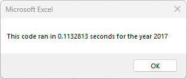
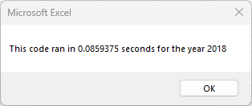

# Stock Analysis with  VBA

## Overview of Project
### Purpose
The purpose of this project was to analyze stock data from 2017 and 2018 using VBA to assist Steve in determining which stocks are worth investing in. Building off our original VBA macros, we refactored the code to reduce the execution time amd create a more efficient code to be used with more data if necessary.

### Background
The data in our spreadsheet consists of 12 different stock information, including a ticker value, the date of stock data being pulled, the opening and closing value, the highest and lowest price, and the total daily volume. The goal was to retrieve each stock and calculate the total daily volume and return, as well as easily representing positive returns with the color green and negative returns with the color red.

## Results
### Analysis
After analyzing the data between 2017 and 2018, we can clearly determine that DQ stock would not be an ideal investment choice for Steve's parents at its current return value. In 2017, DQ stock had almost a 200% gain. However, in 2018, DQ had no positive return value, with a 62.6% loss instead. Based on the data provided, we would recommend investing in ENPH as it has shown a positve return between the two years, with almost 130% in 2017 about 82% in 2018.
<br>
<br>


To calculate these results, we utilized our original VBA script and modified it to loop through all the rows of data and store the data instead of looping through all the rows for each ticker, signifcantly reducing the elapsed time to calculate results.

<br>

Our original loop code:

 ```
   For i = 0 To 11
       ticker = tickers(i)
       totalVolume = 0
       '5) loop through rows in the data
       Sheets(yearValue).Activate
       For j = 2 To RowCount
           '5a) Get total volume for current ticker
           If Cells(j, 1).Value = ticker Then

               totalVolume = totalVolume + Cells(j, 8).Value

           End If
           '5b) get starting price for current ticker
           If Cells(j - 1, 1).Value <> ticker And Cells(j, 1).Value = ticker Then

               startingPrice = Cells(j, 6).Value

           End If

           '5c) get ending price for current ticker
           If Cells(j + 1, 1).Value <> ticker And Cells(j, 1).Value = ticker Then

               endingPrice = Cells(j, 6).Value

           End If
       Next j
       '6) Output data for current ticker
       Worksheets("All Stocks Analysis").Activate
       Cells(4 + i, 1).Value = ticker
       Cells(4 + i, 2).Value = totalVolume
       Cells(4 + i, 3).Value = endingPrice / startingPrice - 1

   Next i
   ```
   
Refactored loop code:
```
 '1b) Create three output arrays
    Dim tickerVolumes(12) As Long
    Dim tickerStartingPrices(12) As Single
    Dim tickerEndingPrices(12) As Single
    
    ''2a) Create a for loop to initialize the tickerVolumes to zero.
    For i = 0 To 11
        tickerVolumes(i) = 0
        tickerStartingPrices(i) = 0
        tickerEndingPrices(i) = 0
    Next i
   
    ''2b) Loop over all the rows in the spreadsheet.
    For i = 2 To RowCount
    
        '3a) Increase volume for current ticker
        tickerVolumes(tickerIndex) = tickerVolumes(tickerIndex) + Cells(i, 8).Value
        
        '3b) Check if the current row is the first row with the selected tickerIndex.
        'If  Then
        If Cells(i, 1).Value = tickers(tickerIndex) And Cells(i - 1, 1).Value <> tickers(tickerIndex) Then
            tickerStartingPrices(tickerIndex) = Cells(i, 6).Value
        End If
        
        '3c) check if the current row is the last row with the selected ticker
         'If the next row’s ticker doesn’t match, increase the tickerIndex.

         If Cells(i, 1).Value = tickers(tickerIndex) And Cells(i + 1, 1).Value <> tickers(tickerIndex) Then
            tickerEndingPrices(tickerIndex) = Cells(i, 6).Value
         End If

            '3d Increase the tickerIndex.
             If Cells(i, 1).Value = tickers(tickerIndex) And Cells(i + 1, 1).Value <> tickers(tickerIndex) Then
                tickerIndex = tickerIndex + 1
            End If
    
    Next i
    
    '4) Loop through your arrays to output the Ticker, Total Daily Volume, and Return.
    For i = 0 To 11
        
        Worksheets("All Stocks Analysis").Activate
        Cells(4 + i, 1).Value = tickers(i)
        Cells(4 + i, 2).Value = tickerVolumes(i)
        Cells(4 + i, 3).Value = tickerEndingPrices(i) / tickerStartingPrices(i) - 1
        
    Next i
```

With our new refactored code, the execution time has significantly decreased. Below is a capture of the new elapsed time for both 2017 and 2018 analysis:


 




## Summary
### Advantages & Disadvantages of Refactoring Code
There are many advantages of refactoring code. Code, overtime, can become excessive and redundant when more and more functionalities are added. A specific code may work perfectly for a set of data, but with bigger datasets, the same analysis can be achieved in mutiple ways. Refactoring code can make the code more organized, more comprehensive, as well as more efficient by using less memory. It also does not affect the functionality of the code.
<br>
<br>
Disadvantages of refactoring code includes the possibility of introducing new bugs and/or errors and taking more time to make adjustments and test the code.


### The Advantages & Disadvantages of the Original VBA Script and the Refactored Script
The biggest advantage of refactoring our VBA script is that the macro ran much faster, over 8x as fast as the original script. With a faster execution time, more data can be analyzed while keeping the code as efficient as we can.

The disadvantage of refactoring the script was that we ran into several errors when altering our variables and loops. With the original script working properly, we consumed more time trying to refactor and strengthen our code to be more efficient. 

As with this project, we had plenty of time to manipulate our script and present a working refactored code without changing its original function. However, with tighter deadlines, this may not always be possible.

